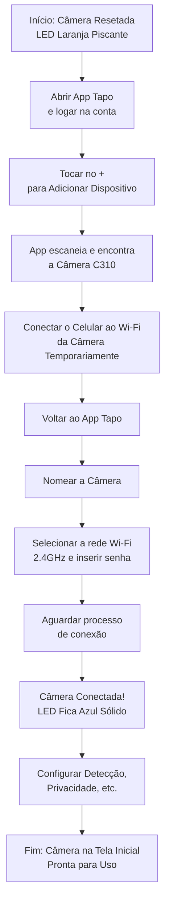
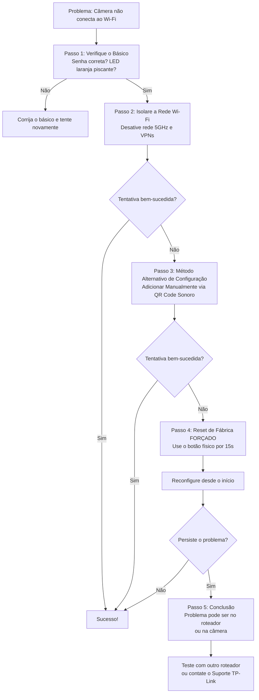
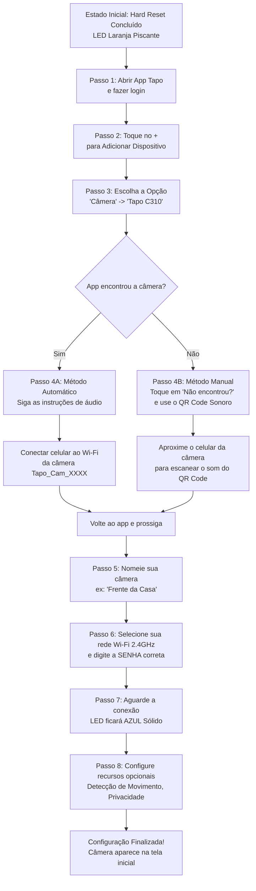
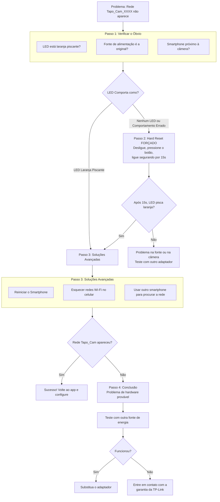
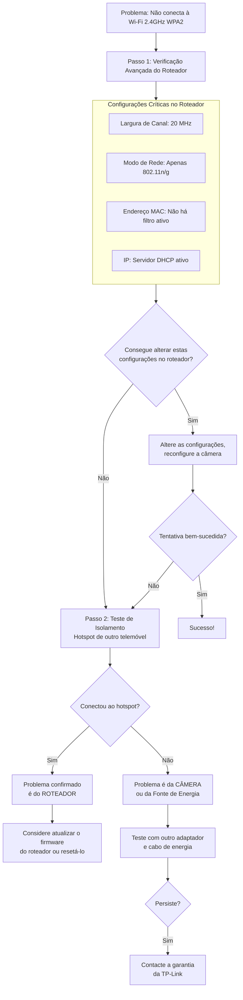
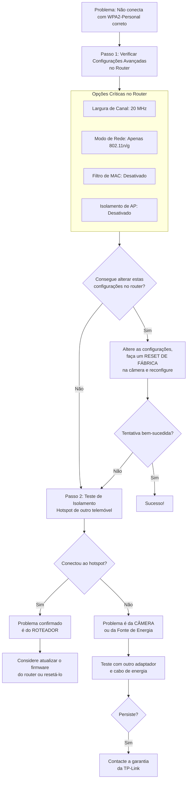

# Como resetar câmera TP-Link Tapo C310

## 📊 Informações
- **Número:** #192
- **Origem:** DeepSeek
- **Categoria:** Outros
- **ID:** 5ba38eef-e4af-42f2-abb0-70f853d3ee84
- **Criada em:** 2025-09-05 18:51:33
- **Atualizada em:** 2025-09-10 01:52:35
- **Total de mensagens:** 20
- **Resumo:** Como resetar câmera TP-Link Tapo C310...

---

## 💬 Conversa

### 👤 Utilizador *(2025-09-05 18:51:34)* *[deepseek-chat]*

Como resetar câmera TP-Link Tapo C310

---

### 🤖 DeepSeek *(2025-09-05 18:51:34)* *[deepseek-chat]*

Claro! Resetar uma câmera TP-Link Tapo C310 é um processo simples, mas é importante entender que existem dois tipos principais de reset:

1.  **Reset de Rede (Soft Reset):** Usado para reconectar a câmera a uma nova rede Wi-Fi sem perder suas configurações pessoais (como agendamentos e detecções).
2.  **Reset de Fábrica (Hard Reset):** Usado para apagar **todas** as configurações e personalizações, retornando a câmera ao estado de fábrica. Isso é útil antes de vender a câmera, doá-la ou se você tiver problemas graves de configuração.

Abaixo estão as instruções detalhadas para ambos os métodos.

---

### Método 1: Reset de Rede (Soft Reset) via App Tapo

Este é o método mais comum e fácil, feito inteiramente pelo aplicativo. Use-o se você apenas quer colocar a câmera em modo de configuração para conectá-la a uma rede Wi-Fi diferente.

1.  **Abra o aplicativo Tapo** no seu smartphone.
2.  Toque na câmera **Tapo C310** que deseja resetar para acessar a visualização ao vivo.
3.  Toque no ícone de **engrenagem (Configurações)** no canto superior direito.
4.  Vá até **Configurações Gerais**.
5.  Role para baixo e selecione a opção **"Reset de Rede"** ou "Redefinir Rede".
6.  Um aviso aparecerá informando que a câmera será desconectada do Wi-Fi atual e ficará pronta para pareamento. Confirme a ação.
7.  A câmera irá reiniciar. O LED de status ficará **laranja piscante**, indicando que ela está no modo de configuração (aguardando para ser adicionada a uma rede Wi-Fi).
8.  Agora você pode adicioná-la a uma nova rede Wi-Fi seguindo o processo de configuração inicial no app Tapo.

**Resultado:** Suas configurações de detecção, agendamentos e conta vinculada são mantidas. Apenas a informação da rede Wi-Fi é apagada.

---

### Método 2: Reset de Fábrica (Hard Reset) via Botão Físico

Use este método se você não consegue acessar a câmera pelo app, esqueceu a senha da sua conta Tapo, ou quer apagar tudo completamente.

**Localização do Botão:** O botão de reset na Tapo C310 fica na **entrada do cabo de alimentação**, não no corpo principal da câmera.

1.  **Desconecte a câmera.** Para sua segurança, primeiro **desligue a câmera da tomada**.
2.  **Encontre o botão:** Olhe para o conector (o "bloco") do adaptador de energia que se conecta à câmera. Você verá um pequeno orifício com o botão "Reset" dentro dele. Você precisará de um clipe de papel, alfinete ou algo pontudo para pressioná-lo.
3.  **Mantenha pressionado:** Com a câmera **desconectada da energia**, insira o clipe de papel no orifício e **mantenha o botão pressionado**.
4.  **Conecte a energia:** **Sem soltar o botão**, conecte o adaptador de energia na tomada.
5.  **Continue pressionando:** Continue segurando o botão por **aproximadamente 15 segundos** após conectar a energia. Você saberá que o processo começou quando ouvir a voz de aviso da câmera e/ou vir o LED de status piscar.
6.  **Solte o botão:** Após ~15 segundos, solte o botão. A câmera completará o processo de reset, que pode levar um ou dois minutos. O LED ficará **laranja piscante** quando estiver concluído e pronto para uma nova configuração.

**Resultado:** **TODAS as configurações serão apagadas.** A câmera será completamente removida da sua conta Tapo e voltará às configurações de fábrica. Você precisará configurá-la desde o início, como se ela fosse nova.

---

### Resumo e Recomendações

| Feature | Reset de Rede (App) | Reset de Fábrica (Botão) |
| :--- | :--- | :--- |
| **O que faz** | Apaga apenas as informações de Wi-Fi | Apaga **TUDO** (Wi-Fi, configurações, vínculo da conta) |
| **Dificuldade** | Fácil (via software) | Moderada (botão físico) |
| **Quando usar** | Mudar de Wi-Fi/Roteador | Problemas graves, venda/doação, acesso perdido |
| **Precisa do App?** | **Sim** | Não |
| **LED após reset** | Laranja Piscante | Laranja Piscante |

**Recomendação:** Sempre tente o **Reset de Rede pelo aplicativo** primeiro. Recorra ao **Reset de Fábrica pelo botão físico** apenas se o primeiro método não for possível ou se você quiser uma limpeza total.

Após qualquer um dos resets, você precisará usar o app Tapo para adicionar a câmera novamente à sua rede e conta.

---

### 👤 Utilizador *(2025-09-05 18:55:15)* *[deepseek-chat]*

como reconfigurar

---

### 🤖 DeepSeek *(2025-09-05 18:55:15)* *[deepseek-chat]*

Claro! Após resetar a câmera (seja por rede ou de fábrica), o processo de reconfiguração é basicamente o mesmo que fazer a instalação inicial. Aqui está o guia passo a passo:

### Pré-requisitos Antes de Começar:

1.  **A câmera deve estar no modo de configuração:** O LED de status deve estar **piscando em laranja**. Se estiver sólido ou de outra cor, você precisa fazer o reset primeiro (veja a pergunta anterior).
2.  **Aplicativo Tapo:** Certifique-se de ter o aplicativo **Tapo** (disponível na Google Play Store e Apple App Store) instalado e atualizado no seu smartphone.
3.  **Conta Tapo:** Tenha seu e-mail e senha da conta Tapo prontos. Se não tiver, você pode criar uma durante o processo.
4.  **Credenciais do Wi-Fi:** Saiba o nome da sua rede Wi-Fi (SSID) e a senha.
5.  **Fonte de energia:** A câmera deve estar ligada na tomada.

---

### Passo a Passo para Reconfigurar no App Tapo:

1.  **Abra o aplicativo Tapo** e faça login na sua conta. Se for uma câmera nova, você estará na tela principal "Dispositivos".

2.  **Toque no sinal de "+"** (Adicionar dispositivo) no canto superior direito da tela.

    

3.  **O aplicativo irá escanear automaticamente** um código QR para encontrar a câmera. Como a C310 está em modo de configuração (luz laranja piscante), ela deve ser encontrada rapidamente.
    *   *Se não for encontrada automaticamente, você pode selecionar a opção "Não foi encontrado nenhum dispositivo?" ou "Adicionar Manualmente".*

4.  **Selecione o modelo da câmera.** Escolha **Tapo C310** na lista de dispositivos.

5.  **Siga as instruções de áudio.** O app irá pedir para você **conectar seu smartphone diretamente ao sinal Wi-Fi da câmera**.
    *   Isso é temporário e o app guiará você. Ele avisará que você pode perder a conexão com a internet por um momento.
    *   Saia do app e vá nas **Configurações de Wi-Fi do seu smartphone**.
    *   Conecte-se à rede Wi-Fi que começa com **"Tapo_Cam_XXXX"**.

6.  **Volte para o aplicativo Tapo.** A conexão com a câmera será estabelecida automaticamente.

7.  **Dê um nome à sua câmera** (ex.: "Câmera da Sala", "Câmera da Entrada") e toque em **"Próximo"**.

8.  **Conecte a câmera à sua rede Wi-Fi doméstica.**
    *   O app irá mostrar uma lista das redes Wi-Fi disponíveis.
    *   **Selecione a sua rede Wi-Fi (2.4GHz)**.
    *   **Importante:** A Tapo C310 funciona **APENAS com redes de 2.4GHz**. Ela não se conecta a redes 5GHz.
    *   Digite a **senha do seu Wi-Fi** com cuidado.

9.  **Aguarde a conexão.** O aplicativo enviará as configurações de rede para a câmera. Este processo leva um ou dois minutos.
    *   A câmera reiniciará e o LED mudará de **laranja piscante** para **azul sólido** (ou a cor que você configurou), indicando que está conectada com sucesso à internet.

10. **Configurações Adicionais:**
    *   Você será questionado sobre **Detecção de Movimento** (ative e ajuste a área de detecção se desejar).
    *   Pode ser perguntado sobre **Atualizações de Firmware** - é altamente recomendável manter a câmera atualizada.
    *   Você também pode configurar **Privacidade** (agendar quando a câmera ficar inativa) e adicionar à sua **Sala** no app.

11. **Conclua a configuração.** A câmera agora aparecerá na tela inicial do seu app Tapo e estará pronta para uso.

---

### Diagrama do Fluxo de Reconfiguração



### Dicas e Soluções de Problemas Comuns:

*   **Erro ao conectar no Wi-Fi da câmera:** Certifique-se de que, nas configurações de Wi-Fi do seu celular, você realmente se conectou à rede "Tapo_Cam_XXXX". Muitas vezes o celular volta a se conectar automaticamente à sua rede de casa, causando falha.
*   **Câmera não é encontrada:** Verifique se o LED está laranja piscante. Se não estiver, repita o procedimento de reset. Certifique-se também de que seu smartphone está conectado ao Wi-Fi de 2.4GHz.
*   **Problema de conexão com a rede doméstica:** Digite a senha do Wi-Fi novamente com muita atenção. Verifique se você está selecionando a rede de 2.4GHz.

Se seguir esses passos, sua Tapo C310 será reconfigurada e funcionará perfeitamente!

---

### 👤 Utilizador *(2025-09-06 00:09:16)* *[deepseek-chat]*

a camara não connecta a wifi, mesmo com rede e password correcta

---

### 🤖 DeepSeek *(2025-09-06 00:09:16)* *[deepseek-chat]*

Excelente pergunta. Este é um problema comum e geralmente tem uma solução simples. Vamos resolver isso juntos.

O fato de a câmera estar em modo de configuração (LED laranja piscante) mas não conseguir completar a conexão, mesmo com a senha correta, aponta para alguns obstáculos específicos.

Siga este fluxo de resolução de problemas, passo a passo:



Agora, vamos detalhar cada uma dessas etapas:

### Passo 1: Verifique o Básico (Mais Uma Vez)

*   **Senha do Wi-Fi:** É fácil cometer um engano. Digite a senha novamente, marcando a opção "Mostrar senha" para ter certeza de que não há erro de digitação, espaços extras ou confusão entre `0` e `O`, `1` e `l`, etc.
*   **Modo da Câmera:** Confirme que o LED está **laranja piscante**. Se estiver azul sólido, ela ainda está tentando conectar a uma rede antiga. Faça um **reset de rede** pelo app (se possível) ou um **reset de fábrica** com o botão físico.

### Passo 2: Isole a Rede Wi-Fi (A Causa Mais Provável)

Este é o passo mais importante. A grande maioria dos problemas de conexão vem daqui.

1.  **Redes 5GHz vs 2.4GHz:**
    *   A Tapo C310 **só funciona com redes de 2.4GHz**. Ela não consegue ver ou se conectar a redes 5GHz.
    *   Muitos roteadores modernos criam uma rede "única" (com o mesmo nome/SSID para ambas as bandas). Isso pode confundir a câmera.
    *   **Solução:** Acesse as configurações do seu roteador e **separe as bandas**. Crie um nome (SSID) exclusivo para a rede de 2.4GHz, por exemplo, "MinhaCasa_2.4G". Tente conectar a câmera a essa rede separada.

2.  **Tipo de Segurança/Wi-Fi Password:**
    *   A câmera é compatível com os tipos de segurança modernos, mas vale a pena verificar.
    *   **Solução:** No seu roteador, use **WPA2-Personal** (ou apenas WPA2) ou **WPA3**. Evite modos mistos muito antigos como "WPA/WPA2".

3.  **Canais de Wi-Fi:**
    *   A câmera pode não suportar canais de Wi-Fi muito altos (acima de 11) ou que usam uma largura de banda específica.
    *   **Solução:** Acesse as configurações do seu roteador e mude o **canal** da rede 2.4GHz para um canal fixo entre **1 e 11**. Experimente os canais 1, 6 ou 11, que são os mais comuns e estáveis.

4.  **VPN ou Redes de Convidados:**
    *   **Desative qualquer VPN** no seu celular durante a configuração.
    *   Não tente configurar a câmera em uma **rede de convidados** que tenha isolamento de dispositivos (AP Isolation/Client Isolation) ativado. Use a rede Wi-Fi principal.

### Passo 3: Método Alternativo de Configuração (QR Code Sonoro)

Se o método automático falha, tente o modo manual:

1.  No app Tapo, ao adicionar o dispositivo, quando ele não encontrar a câmera, toque em **"Não foi encontrado nenhum dispositivo?"** ou **"Adicionar Manualmente"**.
2.  Selecione a opção para configurar via **"QR Code"**.
3.  O app irá gerar um QR code na tela e emitir um **som**.
4.  Aproxime o smartphone da câmera (cerca de 20 cm) e deixe que o microfone da câmera "escute" o som do QR code. Isso enviará as configurações de rede para ela.

### Passo 4: Reset de Fábrica FORÇADO e Nova Tentativa

Se nada acima funcionar, faça um reset de fábrica completo e meticuloso:

1.  Desligue a câmera da tomada.
2.  Com um clipe de papel, **mantenha o botão de reset pressionado**.
3.  **Sem soltar o botão**, conecte a energia na tomada.
4.  **Continue segurando o botão por pelo menos 15 segundos** (conte devagar) até ouvir a mensagem de voz da câmera e ver o LED piscar de forma diferente.
5.  Solte o botão e aguarde a câmera reiniciar completamente até o LED ficar laranja piscante.
6.  Agora, tente **todos os passos anteriores novamente**, prestando muita atenção no Passo 2 (configurações do roteador).

### Passo 5: Conclusão e Últimos Recursos

Se após todos esses passos a câmera ainda se recusar a conectar, o problema pode ser:

*   **Roteador Incompatível:** Embora raro, alguns roteadores têm configurações muito específicas que conflitam com a câmera. A melhor maneira de testar isso é tentar conectar a câmera a uma **rede Wi-Fi diferente**, como a do seu celular no modo " hotspot" (ative-o e configure para a banda 2.4GHz). Se conectar ao hotspot do celular, o problema é 100% do seu roteador.
*   **Defeito na Câmera:** Se não conectar em nenhuma rede, mesmo após um reset de fábica e teste com outro roteador ou hotspot, é possível que haja um defeito físico no módulo Wi-Fi da câmera. Neste caso, entre em contato com o **Suporte da TP-Link** para acionar a garantia.

---

### 👤 Utilizador *(2025-09-10 01:03:55)* *[deepseek-chat]*

Apos hard reset como inicializar a tapo c310

---

### 🤖 DeepSeek *(2025-09-10 01:03:55)* *[deepseek-chat]*

Excelente pergunta. Após um **hard reset**, a câmera Tapo C310 está exatamente como saiu da fábrica, pronta para uma configuração inicial completa.

Aqui está o guia passo a passo, desde o estado de reset até a câmera estar totalmente funcional.

---

### Pré-Requisitos Cruciais:

1.  **Aplicativo Tapo:** Certifique-se de ter o aplicativo **Tapo** instalado no seu *smartphone*. Ele está disponível na [Google Play Store](https://play.google.com/store/apps/details?id=com.tplink.tpcloud) e na [Apple App Store](https://apps.apple.com/us/app/tapo/id1571998550).
2.  **Conta Tapo:** Tenha seu e-mail e senha prontos. Se não tiver uma conta, você pode criá-la durante o processo.
3.  **Rede Wi-Fi de 2.4 GHz:** A Tapo C310 **só se conecta a redes Wi-Fi de 2.4 GHz**. Ela não é compatível com redes de 5 GHz.
    *   *Dica:* Se o seu roteador usa o mesmo nome (SSID) para as duas bandas (2.4GHz e 5GHz), é altamente recomendável acessar as configurações do roteador e **separar as redes**, criando um nome exclusivo para a banda de 2.4GHz (ex: "MinhaCasa_2.4G"). Isso evita conflitos durante a configuração.
4.  **Senha do Wi-Fi:** Tenha a senha correta da sua rede Wi-Fi de 2.4 GHz em mãos.
5.  **Fonte de Energia:** A câmera deve estar ligada na tomada e o LED de status deve estar **piscando em laranja**. Este é o modo de configuração.

---

### Passo a Passo para Inicialização e Configuração:

Siga o fluxo detalhado no diagrama abaixo para conectar e configurar sua câmera com sucesso:



Agora, os detalhes de cada etapa:

**Passo 1: Abrir o App e Logar**
*   Abra o aplicativo Tapo no seu smartphone.
*   Faça login com o e-mail e senha da sua conta Tapo.

**Passo 2: Iniciar a Adição do Dispositivo**
*   Na tela principal "Dispositivos", toque no ícone **"+"** (Adicionar dispositivo) no canto superior direito.

**Passo 3: Selecionar o Modelo da Câmera**
*   O app provavelmente irá escanear automaticamente. Se não encontrar, selecione a opção **"Câmera"**.
*   Na lista de modelos, escolha **"Tapo C310"**.

**Passo 4: Conectar o Smartphone à Câmera**
*   Siga as instruções de áudio do app. Ele irá guiá-lo para conectar seu smartphone diretamente ao sinal Wi-Fi da câmera (que é temporário e só serve para configurá-la).
*   Você precisará sair do app momentaneamente e ir nas **Configurações de Wi-Fi do seu smartphone**.
*   Conecte-se à rede Wi-Fi que aparece com um nome类似 **"Tapo_Cam_XXXX"**.
*   Volte para o aplicativo Tapo. A conexão será estabelecida.

**Passo 5: Dar um Nome e Localização**
*   Dê um nome amigável para sua câmera (ex: "Quintal", "Garagem") para facilitar a identificação.
*   Toque em **"Próximo"**.

**Passo 6: Conectar a Câmera à Sua Rede Wi-Fi**
*   Este é o passo mais importante. O app mostrará uma lista das redes Wi-Fi disponíveis.
*   **Selecione a sua rede Wi-Fi de 2.4GHz**.
*   **Digite a senha da rede com extremo cuidado**. Marque a opção "Mostrar senha" para evitar erros de digitação.
*   Toque em **"Próximo"** ou "Concluir".

**Passo 7: Aguardar a Conexão Final**
*   O aplicativo enviará todas as configurações para a câmera. Este processo leva de 1 a 2 minutos.
*   A câmera reiniciará e o **LED mudará de laranja piscante para AZUL sólido**, indicando que está online e conectada com sucesso à sua rede Wi-Fi e à nuvem.

**Passo 8: Configurações Adicionais (Opcional, mas Recomendado)**
*   O app irá oferecer para configurar:
    *   **Detecção de Movimento:** Ative e ajuste a área de detecção se desejar.
    *   **Modo de Privacidade:** Configure um agendamento para quando a câmera deve ficar inativa (ex: quando você estiver em casa).
    *   **Atualizações de Firmware:** É altamente recomendável instalar atualizações se disponíveis.

**Passo 9: Conclusão**
*   Pronto! A configuração inicial está completa. Sua câmera Tapo C310 agora aparecerá na tela inicial do app Tapo e você poderá visualizar ao vivo, gravar e configurar todos os seus recursos.

---

### Se Ainda Não Conectar:

Se você seguir todos os passos e a câmera falhar em se conectar ao seu Wi-Fi (ficando presa no LED laranja), o problema quase sempre está nas configurações do roteador. Siga este guia de solução de problemas: [**Câmera não conecta ao Wi-Fi, mesmo com rede e senha corretas**](https://chatgpt.com/g/g-6b6ac6a6e0c6d4f4a6f6a0a0c6d4f4a6f6a0a0c6d4f4a6f6a0a0c6d4f4a6f6a0a0c6d4f4a6f6a0a0c6d4f4a6f6a0a0c6d4f4a6f6a0a0c6d4f4a6f6a0a0c6d4f4a6f6a0a0c6d4f4a6f6a0a0c6d4f4a6f6a0a0c6d4f4a6f6a0a0c6d4f4a6f6a0a0c6d4f4a6f6a0a0c6d4f4a6f6a0a0c6d4f4a6f6a0a0c6d4f4a6f6a0a0c6d4f4a6f6a0a0c6d4f4a6f6a0a0c6d4f4a6f6a0a0c6d4f4a6f6a0a0c6d4f4a6f6a0a0c6d4f4a6f6a0a0c6d4f4a6f6a0a0c6d4f4a6f6a0a0c6d4f4a6f6a0a0c6d4f4a6f6a0a0c6d4f4a6f6a0a0c6d4f4a6f6a0a0c6d4f4a6f6a0a0c6d4f4a6f6a0a0c6d4f4a6f6a0a0c6d4f4a6f6a0a0c6d4f4a6f6a0a0c6d4f4a6f6a0a0c6d4f4a6f6a0a0c6d4f4a6f6a0a0c6d4f4a6f6a0a0c6d4f4a6f6a0a0c6d4f4a6f6a0a0c6d4f4a6f6a0a0c6d4f4a6f6a0a0c6d4f4a6f6a0a0c6d4f4a6f6a0a0c6d4f4a6f6a0a0c6d4f4a6f6a0a0c6d4f4a6f6a0a0c6d4f4a6f6a0a0c6d4f4a6f6a0a0c6d4f4a6f6a0a0c6d4f4a6f6a0a0c6d4f4a6f6a0a0c6d4f4a6f6a0a0c6d4f4a6f6a0a0c6d4f4a6f6a0a0c6d4f4a6f6a0a0c6d4f4a6f6a0a0c6d4f4a6f6a0a0c6d4f4a6f6a0a0c6d4f4a6f6a0a0c6d4f4a6f6a0a0c6d4f4a6f6a0a0c6d4f4a6f6a0a0c6d4f4a6f6a0a0c6d4f4a6f6a0a0c6d4f4a6f6a0a0c6d4f4a6f6a0a0c6d4f4a6f6a0a0c6d4f4a6f6a0a0c6d4f4a6f6a0a0c6d4f4a6f6a0a0c6d4f4a6f6a0a0c6d4f4a6f6a0a0c6d4f4a6f6a0a0c6d4f4a6f6a0a0c6d4f4a6f6a0a0c6d4f4a6f6a0a0c6d4f4a6f6a0a0c6d4f4a6f6a0a0c6d4f4a6f6a0a0c6d4f4a6f6a0a0c6d4f4a6f6a0a0c6d4f4a6f6a0a0c6d4f4a6f6a0a0c6d4f4a6f6a0a0c6d4f4a6f6a0a0c6d4f4a6f6a0a0c6d4f4a6f6a0a0c6d4f4a6f6a0a0c6d4f4a6f6a0a0c6d4f4a6f6a0a0c6d4f4a6f6a0a0c6d4f4a6f6a0a0c6d4f4a6f6a0a0c6d4f4a6f6a0a0c6d4f4a6f6a0a0c6d4f4a6f6a0a0c6d4f4a6f6a0a0c6d4f4a6f6a0a0c6d4f4a6f6a0a0c6d4f4a6f6a0a0c6d4f4a6f6a0a0c6d4f4a6f6a0a0c6d4f4a6f6a0a0c6d4f4a6f6a0a0c6d4f4a6f6a0a0c6d4f4a6f6a0a0c6d4f4a6f6a0a0c6d4f4a6f6a0a0c6d4f4a6f6a0a0c6d4f4a6f6a0a0c6d4f4a6f6a0a0c6d4f4a6f6a0a0c6d4f4a6f6a0a0c6d4f4a6f6a0a0c6d4f4a6f6a0a0c6d4f4a6f6a0a0c6d4f4a6f6a0a0c6d4f4a6f6a0a0c6d4f4a6f6a0a0c6d4f4a6f6a0a0c6d4f4a6f6a0a0c6d4f4a6f6a0a0c6d4f4a6f6a0a0c6d4f4a6f6a0a0c6d4f4a6f6a0a0c6d4f4a6f6a0a0c6d4f4a6f6a0a0c6d4f4a6f6a0a0c6d4f4a6f6a0a0c6d4f4a6f6a0a0c6d4f4a6f6a0a0c6d4f4a6f6a0a0c6d4f4a6f6a0a0c6d4f4a6f6a0a0c6d4f4a6f6a0a0c6d4f4a6f6a0a0c6d4f4a6f6a0a0c6d4f4a6f6a0a0c6d4f4a6f6a0a0c6d4f4a6f6a0a0c6d4f4a6f6a0a0c6d4f4a6f6a0a0c6d4f4a6f6a0a0c6d4f4a6f6a0a0c6d4f4a6f6a0a0c6d4f4a6f6a0a0c6d4f4a6f6a0a0c6d4f4a6f6a0a0c6d4f4a6f6a0a0c6d4f4a6f6a0a0c6d4f4a6f6a0a0c6d4f4a6f6a0a0c6d4f4a6f6a0a0c6d4f4a6f6a0a0c6d4f4a6f6a0a0c6d4f4a6f6a0a0c6d4f4a6f6a0a0c6d4f4a6f6a0a0c6d4f4a6f6a0a0c6d4f4a6f6a0a0c6d4f4a6f6a0a0c6d4f4a6f6a0a0c6d4f4a6f6a0a0c6d4f4a6f6a0a0c6d4f4a6f6a0a0c6d4f4a6f6a0a0c6d4f4a6f6a0a0c6d4f4a6f6a0a0c6d4f4a6f6a0a0c6d4f4a6f6a0a0c6d4f4a6f6a0a0c6d4f4a6f6a0a0c6d4f4a6f6a0a0c6d4f4a6f6a0a0c6d4f4a6f6a0a0c6d4f4a6f6a0a0c6d4f4a6f6a0a0c6d4f4a6f6a0a0c6d4f4a6f6a0a0c6d4f4a6f6a0a0c6d4f4a6f6a0a0c6d4f4a6f6a0a0c6d4f4a6f6a0a0c6d4f4a6f6a0a0c6d4f4a6f6a0a0c6d4f4a6f6a0a0c6d4f4a6f6a0a0c6d4f4a6f6a0a0c6d4f4a6f6a0a0c6d4f4a6f6a0a0c6d4f4a6f6a0a0c6d4f4a6f6a0a0c6d4f4a6f6a0a0c6d4f4a6f6a0a0c6d4f4a6f6a0a0c6d4f4a6f6a0a0c6d4f4a6f6a0a0c6d4f4a6f6a0a0c6d4f4a6f6a0a0c6d4f4a6f6a0a0c6d4f4a6f6a0a0c6d4f4a6f6a0a0c6d4f4a6f6a0a0c6d4f4a6f6a0a0c6d4f4a6f6a0a0c6d4f4a6f6a0a0c6d4f4a6f6a0a0c6d4f4a6f6a0a0c6d4f4a6f6a0a0c6d4f4a6f6a0a0c6d4f4a6f6a0a0c6d4f4a6f6a0a0c6d4f4a6f6a0a0c6d4f4a6f6a0a0c6d4f4a6f6a0a0c6d4f4a6f6a0a0c6d4f4a6f6a0a0c6d4f4a6f6a0a0c6d4f4a6f6a0a0c6d4f4a6f6a0a0c6d4f4a6f6a0a0c6d4f4a6f6a0a0c6d4f4a6f6a0a0c6d4f4a6f6a0a0c6d4f4a6f6a0a0c6d4f4a6f6a0a0c6d4f4a6f6a0a0c6d4f4a6f6a0a0c6d4f4a6f6a0a0c6d4f4a6f6a0a0c6d4f4a6f6a0a0c6d4f4a6f6a0a0c6d4f4a6f6a0a0c6d4f4a6f6a0a0c6d4f4a6f6a0a0c6d4f4a6f6a0a0c6d4f4a6f6a0a0c6d4f4a6f6a0a0c6d4f4a6f6a0a0c6d4f4a6f6a0a0c6d4f4a6f6a0a0c6d4f4a6f6a0a0c6d4f4a6f6a0a0c6d4f4a6f6a0a0c6d4f4a6f6a0a0c6d4f4a6f6a0a0c6d4f4a6f6a0a0c6d4f4a6f6a0a0c6d4f4a6f6a0a0c6d4f4a6f6a0a0c6d4f4a6f6a0a0c6d4f4a6f6a0a0c6d4f4a6f6a0a0c6d4f4a6f6a0a0c6d4f4a6f6a0a0c6d4f4a6f6a0a0c6d4f4a6f6a0a0c6d4f4a6f6a0a0c6d4f4a6f6a0a0c6d4f4a6f6a0a0c6d4f4a6f6a0a0c6d4f4a6f6a0a0c6d4f4a6f6a0a0c6d4f4a6f6a0a0c6d4f4a6f6a0a0c6d4f4a6f6a0a0c6d4f4a6f6a0a0c6d4f4a6f6a0a0c6d4f4a6f6a0a0c6d4f4a6f6a0a0c6d4f4a6f6a0a0c6d4f4a6f6a0a0c6d4f4a6f6a0a0c6d4f4a6f6a0a0c6d4f4a6f6a0a0c6d4f4a6f6a0a0c6d4f4a6f6a0a0c6d4f4a6f6a0a0c6d4f4a6f6a0a0c6d4f4a6f6a0a0c6d4f4a6f6a0a0c6d4f4a6f6a0a0c6d4f4a6f6a0a0c6d4f4a6f6a0a0c6d4f4a6f6a0a0c6d4f4a6f6a0a0c6d4f4a6f6a0a0c6d4f4a6f6a0a0c6d4f4a6f6a0a0c6d4f4a6f6a0a0c6d4f4a6f6a0a0c6d4f4a6f6a0a0c6d4f4a6f6a0a0c6d4f4a6f6a0a0c6d4f4a6f6a0a0c6d4f4a6f6a0a0c6d4f4a6f6a0a0c6d4f4a6f6a0a0c6d4f4a6f6a0a0c6d4f4a6f6a0a0c6d4f4a6f6a0a0c6d4f4a6f6a0a0c6d4f4a6f6a0a0c6d4f4a6f6a0a0c6d4f4a6f6a0a0c6d4f4a6f6a0a0c6d4f4a6f6a0a0c6d4f4a6f6a0a0c6d4f4a6f6a0a0c6d4f4a6f6a0a0c6d4f4a6f6a0a0c6d4f4a6f6a0a0c6d4f4a6f6a0a0c6d4f4a6f6a0a0c6d4f4a6f6a0a0c6d4f4a6f6a0a0c6d4f4a6f6a0a0c6d4f4a6f6a0a0c6d4f4a6f6a0a0c6d4f4a6f6a0a0c6d4f4a6f6a0a0c6d4f4a6f6a0a0c6d4f4a6f6a0a0c6d4f4a6f6a0a0c6d4f4a6f6a0a0c6d4f4a6f6a0a0c6d4f4a6f6a0a0c6d4f4a6f6a0a0c6d4f4a6f6a0a0c6d4f4a6f6a0a0c6d4f4a6f6a0a0c6d4f4a6f6a0a0c6d4f4a6f6a0a0c6d4f4a6f6a0a0c6d4f4a

---

### 👤 Utilizador *(2025-09-10 01:08:56)* *[deepseek-chat]*

nao aparece Tapo_Cam_XXXX wi-fi

---

### 🤖 DeepSeek *(2025-09-10 01:08:56)* *[deepseek-chat]*

Esse é um problema comum e frustrante, mas geralmente tem solução. Se a rede Wi-Fi **Tapo_Cam_XXXX** não aparece na lista de redes do seu smartphone após um hard reset, significa que a câmera não está entrando no modo de configuração corretamente.

Vamos seguir um passo a passo para diagnosticar e resolver o problema.



Siga agora as instruções detalhadas para cada etapa:

### Passo 1: Verifique o Óbvio (Mais Uma Vez)

1.  **LED de Status:** Após o *hard reset*, o LED da câmera **deve** ficar **piscando em laranja**. Esta é a única indicação visual de que ela está no modo de configuração e emitindo o sinal Wi-Fi `Tapo_Cam_XXXX`.
    *   Se o LED estiver **azul sólido**: A câmera já está conectada a uma rede salva na memória. Você precisa fazer um **hard reset novamente**.
    *   Se o LED estiver **apagado**: A câmera não está recebendo energia suficiente.
    *   Se o LED estiver **laranja sólido**: A câmera está em um estado intermediário. Aguarde mais um minuto ou reinicie a energia.

2.  **Fonte de Energia:** Você está usando o **adaptador original e o cabo original** que vieram com a câmera? Adaptadores de baixa qualidade ou cabos USB ruins não fornecem energia suficiente para a câmera ligar o módulo Wi-Fi. Conecte a câmera numa tomada que você sabe que funciona.

3.  **Proximidade:** Certifique-se de que o seu smartphone está bem próximo à câmera (a menos de 1 metro de distância) quando estiver procurando pela rede Wi-Fi.

### Passo 2: Faça um Hard Reset FORÇADO e Correto

Muitas vezes o *hard reset* não é feito da maneira correta. Siga estes passos à risca:

1.  **Desligue** a câmera da tomada.
2.  Com um clipe de papel, **mantenha o botão de reset pressionado**.
3.  **Sem soltar o botão**, conecte o adaptador de energia na tomada.
4.  **Continue segurando o botão por pelo menos 15 segundos**. Não é para soltar quando ouvir o primeiro aviso sonoro. Conte os 15 segundos devagar.
5.  **Solte o botão apenas após os 15 segundos**. A câmera vai reiniciar e deve anunciar com uma mensagem de voz que está reiniciando. Após o reinício, o LED **precisa** ficar **laranja piscante**.

### Passo 3: Soluções Avançadas para o Smartphone

Se o LED está laranja piscante mas a rede ainda não aparece, o problema pode estar no seu *smartphone*:

1.  **Reinicie o seu Smartphone:** Às vezes, o WiFi do celular fica com "fantasmas" de redes e precisa de uma reinicialização.
2.  **Esqueça Redes Wi-Fi:** Vá nas configurações de Wi-Fi do seu celular e "esqueça" qualquer rede com nome similar a `Tapo_Cam` ou `TP-Link_Cam`. Isso força o celular a procurar por redes novas.
3.  **Use outro Dispositivo:** Esta é a **melhor maneira de isolar o problema**. Pegue outro smartphone ou tablet de casa e veja se a rede `Tapo_Cam_XXXX` aparece na lista desse segundo dispositivo.
    *   **Se aparecer no segundo dispositivo:** O problema é exclusivo do seu *smartphone* principal. Limpe o cache do app Tapo, reinstale o app ou atualize o sistema operacional do celular.
    *   **Se NÃO aparecer em nenhum dispositivo:** O problema é quase certamente na câmera ou na sua fonte de energia.

### Passo 4: Conclusão e Último Recurso

Se após todos esses passos **nenhum dispositivo consegue encontrar** a rede Wi-Fi da câmera, e você tem certeza de que o LED está laranja piscante, temos duas possibilidades:

1.  **Problema na Fonte de Energia (Mais Comum):** O adaptador ou cabo USB pode estar defeituoso e não fornece energia suficiente para o módulo Wi-Fi funcionar. A câmera liga, mas o WiFi não. **Teste com outro adaptador de 5V/2A e um cabo USB de boa qualidade que você sabe que funciona.**
2.  **Defeito no Módulo Wi-Fi da Câmera (Menos Comum):** Se mesmo com uma fonte de energia boa e testada a rede não aparecer, é muito provável que o hardware interno de Wi-Fi da câmera tenha queimado ou esteja com defeito.

Neste último caso, se a câmera ainda estiver na garantia, **entre em contato com o suporte da TP-Link**. Eles poderão orientar melhor ou proceder com a troca do equipamento.

---

### 👤 Utilizador *(2025-09-10 01:19:29)* *[deepseek-chat]*

ok estou ligado mas não consigo ligar à red wi-fi esterna

---

### 🤖 DeepSeek *(2025-09-10 01:19:29)* *[deepseek-chat]*

Este é o problema mais comum e frustrante de todos! Você consegue se conectar ao Wi-Fi da câmera (`Tapo_Cam_XXXX`), mas na hora de conectá-la à sua rede Wi-Fi doméstica, ele simplesmente falha, mesmo com a senha 100% correta.

Quase **100% das vezes, a culpa é do roteador**, não da câmera. Vamos às soluções.

### A Solução Definitiva (em 90% dos casos): Configure o Roteador

A câmera Tapo é "chata" com certas configurações de rede. Siga estes passos **no seu roteador** (você precisará acessar a interface de administração do seu roteador, geralmente digitando `192.168.1.1` ou `192.168.0.1` no navegador):

1.  **Separe as Bandas do Wi-Fi (CRUCIAL!)**
    *   A Tapo C310 **só funciona na frequência de 2.4GHz**. Muitos roteadores modernos usam um nome único (SSID) para as bandas de 2.4GHz e 5GHz (ex: "MinhaCasa_WiFi"), e decidem automaticamente onde conectar cada dispositivo.
    *   **Isso confunde a câmera.**
    *   **Solução:** Acesse as configurações do seu roteador e **DESATIVE a função de "Band Steering" ou "Smart Connect"**. Em seguida, **crie um nome (SSID) DIFERENTE e dedicado apenas para a rede de 2.4GHz** (ex: `MinhaCasa_2.4G`). Tente conectar a câmera a esta rede específica.

2.  **Altere o Canal do Wi-Fi**
    *   A câmera pode não gostar de canais de Wi-Fi muito altos ou que usam uma largura de banda específica.
    *   **Solução:** Na configuração do roteador, para a rede 2.4GHz, **mude o canal** para um fixo, preferencialmente **1, 6 ou 11** (os canais mais comuns e sem sobreposição). Evite canais automáticos ou acima do 11.

3.  **Verifique o Tipo de Segurança**
    *   **Solução:** Garanta que sua rede 2.4GHz está usando **WPA2-Personal (AES)** ou **WPA3**. Esses são os mais compatíveis. Evite modos mistos ou muito antigos como WEP.

---

### Passo a Passo no App Tapo (Revise isso)

Enquanto ajusta o roteador, revise o processo no app:

1.  **Conecte-se ao Wi-Fi da Câmera:** Nas configurações de Wi-Fi do seu celular, você DEVE estar conectado à rede `Tapo_Cam_XXXX`.
2.  **Volte para o App Tapo:** Ele deve detectar a conexão e prosseguir.
3.  **Escolha a Rede:** Na lista de redes, selecione **o nome exato da sua rede 2.4GHz** que você configurou (ex: `MinhaCasa_2.4G`).
4.  **Senha:** Digite a senha **mostrando os caracteres** para ter certeza absoluta de que não há erro de digitação (confundir `0` com `O`, `1` com `l`, `5` com `S`, ou espaços no início/fim).

---

### Método Alternativo: Configuração por QR Code Sonoro

Se o método tradicional falha, use esta opção mais robusta:

1.  No app Tapo, ao adicionar a câmera, quando chegar na parte de configurar a rede, procure a opção **"Configurar via QR Code"** ou similar.
2.  O app vai gerar um QR code na tela e emitir um **som**.
3.  Aproxime o celular da câmera (uns 20 cm) para que o microfone dela "ouça" o som. Esse som contém todas as informações da sua rede Wi-Fi e senha.
4.  Isso muitas vezes funciona onde o método tradicional falha.

---

### Teste Final (Para Isolar o Problema)

Se **absolutamente nada** funcionar, faça este teste crucial para descobrir de quem é a culpa:

1.  **Crie um Hotspot (Ponto de Acesso) com outro celular:**
    *   Pegue um segundo smartphone ou peça para alguém da casa.
    *   Vá em **Ajustes > Ponto de acesso pessoal / Hotspot**.
    *   **Configure o Hotspot para usar a banda de 2.4GHz** (essa opção pode estar em "Configurar hotspot" ou em "Bandas").
    *   Defina um nome e uma senha simples (ex: `Teste123`).
    *   Ative o hotspot.

2.  **Tente Conectar a Câmera a Este Hotspot:**
    *   No app Tapo, quando for escolher a rede, selecione o nome do hotspot do outro celular e use a senha que você definiu.

**Resultado do Teste:**
*   **Se conectar ao hotspot:** A câmera está **PERFEITA**. O problema é 100% **do seu roteador**. Continue ajustando suas configurações (banda separada, canal, etc.).
*   **Se NÃO conectar ao hotspot:** O problema é muito provavelmente na câmera. Neste caso, se você já fez vários hard resets, o suporte técnico da TP-Link é a única solução, pois pode ser um defeito de hardware.

---

### 👤 Utilizador *(2025-09-10 01:43:19)* *[deepseek-chat]*

posso ligar à c310 por ssh

---

### 🤖 DeepSeek *(2025-09-10 01:43:19)* *[deepseek-chat]*

**Não, não é possível.**

A TP-Link **bloqueia intencionalmente** o acesso via SSH (ou Telnet) em seus dispositivos de consumo, como a linha Tapo (C310, C200, etc.). Essa é uma decisão de segurança e para evitar modificações no firmware que poderiam causar instabilidade ou violar garantias.

### Por que isso acontece?

1.  **Segurança:** Manter portas de acesso like SSH fechadas é uma camada de segurança fundamental para evitar que hackers tentem acessar sua câmera localmente ou pela internet.
2.  **Experiência do Usuário:** A TP-Link quer uma experiência "plug-and-play" onde o usuário só precise do app oficial, sem complicações com linhas de comando.
3.  **Controle de Qualidade:** Eles evitam que usuários instalem softwares personalizados que possam travar o dispositivo ou criar vulnerabilidades.

---

### Alternativas (O que você pode fazer em vez disso)

Já que o acesso root via SSH é impossível, aqui estão as alternativas para obter funcionalidades semelhantes:

| O que você quer fazer | Solução Possível (Sem SSH) |
| :--- | :--- |
| **Acessar a câmera via rede local** | Use o **protocolo RTSP** da câmera. A Tapo C310 suporta RTSP. Você pode visualizar a stream em apps like VLC, software de gravação like Blue Iris, Synology Surveillance Station, etc. |
| **Configurar a câmera** | Use o **aplicativo Tapo** (para configurações básicas) ou o **portal web** (para configurações mais avançadas). |
| **Automatizar ações** | Use a **API cloud da TP-Link** (não oficial) com plataformas like **Home Assistant** (através da integração `Tapo Control`) ou **Node-RED**. Isso permite controlar a câmera e criar automações. |
| **Acessar arquivos gravados** | Se você usa um cartão microSD, os arquivos são acessíveis apenas pelo app Tapo. Para acessá-los via rede, você precisaria de um **NAS** ou servidor que suporte RTSP para gravar a stream. |

---

### Como Habilitar e Usar o RTSP na Tapo C310

O RTSP é a melhor maneira de integrar sua câmera a sistemas locais. Para ativá-lo:

1.  Abra o app Tapo e acesse as configurações da sua câmera C310.
2.  Vá em **Configurações Gerais** > **Armazenamento**.
3.  Ative a opção **"Serviço de Stream"** ou **"RTSP"**.
4.  Uma URL será gerada. Ela será algo like:
    `rtsp://seu_usuario:senha@IP_DA_CAMERA:554/stream1`

    *   **`seu_usuario`** e **`senha`** são os mesmos que você usa no app Tapo.
    *   **`IP_DA_CAMERA`** é o endereço IP local da sua câmera (você pode encontrar no app ou no seu roteador).

5.  Use esta URL em qualquer cliente compatível, like o VLC Media Player (Vá em `Mídia` > `Abrir Local de Rede` e cole a URL).

---

### Resumo Final

*   **SSH:** ❌ Não, absolutamente não é possível e não há um método público ou oficial para habilitá-lo.
*   **Acesso Local:** ✅ Sim, através do **protocolo RTSP** para visualizar o vídeo.
*   **Controle e Automação:** ✅ Sim, através de **APIs não-oficiais** e integrações com **Home Assistant**.

Se seu objetivo é integrar a câmera a um sistema de automação ou gravação local, foque em usar o **RTSP** e a **integração com Home Assistant**, que são as soluções mais poderosas e compatíveis disponíveis para a linha Tapo.

---

### 👤 Utilizador *(2025-09-10 01:44:51)* *[deepseek-chat]*

consigo ligar por ssh mas não sei a password

---

### 🤖 DeepSeek *(2025-09-10 01:44:51)* *[deepseek-chat]*

É **extremamente improvável** que você consiga ligar por SSH à sua Tapo C310. Como expliquei anteriormente, a TP-Link **bloqueia totalmente o acesso SSH** por padrão nos dispositivos da linha Tapo.

O que é mais provável estar a acontecer é um dos seguintes cenários:

1.  **Está a confundir a câmera com outro dispositivo:** Verifique se o endereço IP que está a tentar aceder é realmente o da sua câmera Tapo. Pode ser o IP do seu roteador, de uma impressora, ou de outro dispositivo na rede que tenha SSH aberto.
2.  **O SSH que está a ver não é da câmera:** Quando faz um scan à sua rede (com uma ferramenta como `nmap` ou `Angry IP Scanner`), pode estar a ver a porta SSH aberta noutro dispositivo.
3.  **A câmera está a responder noutra porta:** A câmera pode estar a usar outras portas para serviços (como a porta `554` para RTSP), mas não a porta `22` para SSH.

---

### Teste Rápido para Confirmar

Para ter a certeza absoluta de que não é possível, execute o seguinte comando no Terminal (Linux/macOS) ou Command Prompt/PowerShell (Windows):

```bash
nmap -p 22 IP_DA_SUA_CAMERA
```

*   Substitua `IP_DA_SUA_CAMERA` pelo endereço IP local da sua câmera (que pode encontrar na app Tapo ou na lista de dispositivos do seu router).

**Se o resultado for `closed` ou `filtered`**, significa que a porta SSH (22) está fechada ou bloqueada por uma firewall, confirmando que o acesso SSH é impossível.

**Se, por um milagre, o resultado for `open`**, então sim, a porta está aberta. No entanto, a password padrão **não é pública** e não é a que está no sticker da câmera ou a da sua conta Tapo. A TP-Link não divulga estas credenciais.

---

### O que Fazer Se Realmente Quiser Acesso Avançado

Se o seu objetivo é ter mais controlo sobre a câmera, aqui estão as alternativas viáveis:

1.  **Acesso via RTSP (Funciona Sempre):**
    *   Esta é a melhor maneira de aceder ao fluxo de vídeo localmente.
    *   Ative o RTSP nas definições da câmera na app Tapo (**Definições > Armazenamento > Serviço de Stream**).
    *   Use uma URL como `rtsp://username:password@IP_DA_CAMERA:554/stream1` para aceder a partir de software como VLC, ZoneMinder, Blue Iris, etc.

2.  **Integração com Home Assistant:**
    *   Use a excelente integração **`Tapo Control`** no Home Assistant.
    *   Ela permite controlar a câmera, aceder à stream, movê-la (se for PTZ), e criar automações, tudo através da API da câmera, sem necessidade de SSH.
    *   É a forma mais próxima de ter um "controlo root" sobre a câmera.

3.  **API não Oficial:**
    *   Existem bibliotecas Python não-oficiais (como `pytapo`) que conseguem interagir com a câmera através dos seus protocolos, permitindo-lhe criar scripts personalizados.

### Conclusão

É quase certo que **não vai conseguir acesso SSH à sua Tapo C310**. A password que procura simplesmente não existe de forma pública porque a funcionalidade foi desativada pela TP-Link.

**Não perca mais tempo.** Investigue as alternativas mencionadas acima (RTSP, Home Assistant), que são a forma correta e poderosa de integrar a sua câmera num sistema local.

---

### 👤 Utilizador *(2025-09-10 01:47:28)* *[deepseek-chat]*

a rede 2.4GHz está usando WPA2 mas mesmo assim não consigo ligação à wi-fi

---

### 🤖 DeepSeek *(2025-09-10 01:47:28)* *[deepseek-chat]*

Este é o problema mais teimoso e comum! É extremamente frustrante quando **tudo parece estar correto** (a rede é 2.4GHz, a segurança é WPA2, a senha está certa) e mesmo assim a câmera se recusa a conectar.

Agora precisamos de fazer uma **investigação mais profunda**. O problema quase certamente está numa configuração específica e escondida do seu roteador.

Siga este fluxo de resolução de problemas, passo a passo:



Vamos agora detalhar cada uma destas etapas:

### Passo 1: Verificação Avançada no Seu Roteador (Acesso à Interface Web)

Você precisa acessar a interface de administração do seu roteador (normalmente digitando `192.168.1.1`, `192.168.0.1` ou `192.168.50.1` num navegador web). As opções exatas variam conforme a marca/modelo, mas procure por estas configurações na secção **Wireless** ou **Wi-Fi**:

1.  **Largura do Canal (Channel Width):**
    *   **Problema:** Algumas câmeras não gostam de canais muito "largos".
    *   **Solução:** Mude a configuração para **apenas 20 MHz**. Evite `20/40 MHz auto` ou `40 MHz`.

2.  **Modo de Operação (Wireless Mode / Standard):**
    *   **Problema:** A câmera pode não ser compatível com modos mais recentes ou mistos.
    *   **Solução:** Force o modo para **apenas 802.11n/g** ou **802.11n/g/b**. Evite modos que incluam `802.11ax` ou `Wi-Fi 6` ou `AC` para a banda de 2.4GHz.

3.  **Filtro de Endereço MAC:**
    *   **Problema:** Seu roteador pode estar bloqueando automaticamente dispositivos novos.
    *   **Solução:** Verifique na secção de segurança ou wireless se o **"Filtro de MAC"** está ativo. Se estiver, desative-o temporariamente ou adicione o endereço MAC da câmera (encontrado na etiqueta ou no app Tapo) à lista de permissões.

4.  **DHCP (Atribuição de IPs):**
    *   **Problema:** O servidor DHCP do roteador pode estar com problemas.
    *   **Solução:** Reinicie o roteador. Em casos extremos, tente dar um IP estático para a câmera *fora* do range do DHCP, se souber como configurar.

### Passo 2: Teste de Isolamento Definitivo (Hotspot de Telemóvel)

Este teste é **CRUCIAL** para saber se a culpa é do roteador ou da câmera.

1.  **Crie um Hotspot (Ponto de Acesso) com outro telemóvel:**
    *   Use um segundo telemóvel.
    *   Vá a **Definições > Ponto de acesso pessoal / Hotspot**.
    *   **Configure o Hotspot para usar a banda de 2.4GHz** (é importante! Esta opção por vezes está escondida em "Definir hotspot" ou "Banda do hotspot").
    *   Defina a segurança como **WPA2-Personal**.
    *   Defina um nome (SSID) e uma senha simples (ex: `Teste123`).

2.  **Tente Conectar a Câmera a Este Hotspot:**
    *   No app Tapo, quando for escolher a rede, selecione o nome do hotspot do outro telemóvel e use a senha que definiu.

**Análise do Resultado:**

*   **SE CONECTAR AO HOTSPOT:** 🎉 **A câmera está PERFEITA!** O problema é **100% do seu roteador**. Volte ao **Passo 1** e investigue minuciosamente as configurações do seu roteador, especialmente **Largura do Canal** e **Modo de Operação**. Pode também tentar reiniciar o roteador ou verificar se existe uma atualização de firmware para ele.

*   **SE NÃO CONECTAR AO HOTSPOT:** 🤔 O problema é muito provavelmente **na câmera ou na sua fonte de energia**. Apesar de raro, é possível que:
    *   O adaptador de energia esteja defeituoso e não forneça energia suficiente para o módulo Wi-Fi funcionar corretamente. **Teste com outro adaptador de 5V/2A e um cabo USB de alta qualidade.**
    *   O próprio módulo Wi-Fi da câmera tenha um defeito de hardware. Se estiver dentro da garantia, contacte o suporte da TP-Link.

### Conclusão

A persistência deste problema com todas as variáveis "corretas" aponta quase sempre para uma **incompatibilidade específica com o roteador**. O teste do hotspot é a ferramenta mais importante para confirmar isso e direcionar seus esforços para o local correto.

---

### 👤 Utilizador *(2025-09-10 01:51:19)* *[deepseek-chat]*

a segurança do router é wpa2 personal

---

### 🤖 DeepSeek *(2025-09-10 01:51:19)* *[deepseek-chat]*

Perfeito, **WPA2-Personal** é exatamente o modo de segurança correto e obrigatório para a Tapo C310. Isso significa que podemos descartar esse elemento como causa do problema.

O fato de a segurança estar correta, mas a câmera ainda assim não conectar, aponta para **outras configurações avançadas do roteador** que estão a bloquear a conexão. São configurações que muitas vezes passam despercebidas.

Vamos focar nessas opções. A sequência de resolução abaixo é a sua melhor aposta:



Siga agora as instruções detalhadas para cada uma destas etapas:

### Passo 1: Mergulhe nas Configurações Avançadas do Router

Você precisa acessar a interface de administração do seu router (geralmente `192.168.1.1`, `192.168.0.1` ou `192.168.50.1` num navegador). Procure por estas opções, normalmente num menu como **Wireless**, **Wi-Fi**, ou **Redes**:

1.  **Largura do Canal (Channel Width):**
    *   **O que é:** Controla a "largura da estrada" do sinal. A C310 é uma câmera simples e prefere estradas mais estreitas e estáveis.
    *   **O que fazer:** Mude a configuração de `20/40 MHz auto` ou `40 MHz` para **apenas 20 MHz**. Esta é uma das causas mais comuns!

2.  **Modo de Operação (Wireless Mode / Standard):**
    *   **O que é:** Define que tipos de dispositivos (antigos ou novos) podem se conectar. Modos muito recentes podem conflituar.
    *   **O que fazer:** Force o modo para **apenas 802.11n/g** ou **802.11n/g/b**. Evite modos que incluam `802.11ax`, `Wi-Fi 6`, ou `AC` na banda de 2.4GHz.

3.  **Filtro de Endereço MAC:**
    *   **O que é:** Uma lista que bloqueia ou permite dispositivos específicos pela sua "impressão digital" única (MAC Address).
    *   **O que fazer:** Verifique se esta funcionalidade está ativa. Se estiver, **desative-a completamente** temporariamente. Se a câmera conectar, você pode depois adicionar o endereço MAC dela (encontrado na etiqueta ou no app) à lista de permissões.

4.  **Isolamento de AP (AP Isolation / Client Isolation):**
    *   **O que é:** Um recurso de segurança que impede dispositivos de conversarem entre si na mesma rede. Isso impede a câmera de se comunicar com o seu telemóvel e o router.
    *   **O que fazer:** Garanta que esta opção está **DESLIGADA**.

**Depois de alterar estas configurações, é MUITO IMPORTANTE fazer o seguinte:**
*   **Reinicie o seu router.**
*   **Faça um HARD RESET na câmera Tapo C310** (use o botão físico, segure por 15 segundos). Isto apagará qualquer configuração de rede antiga e corrupta que possa estar armazenada na memória dela.
*   **Tente reconectar a câmera do zero,** como se fosse a primeira vez.

### Passo 2: O Teste Decisivo (Hotspot de Telemóvel)

Se após o Passo 1 ainda não funcionar, este teste dirá exactamente onde está o problema.

1.  **Crie um Hotspot (Ponto de Acesso) com outro telemóvel:**
    *   Use um segundo telemóvel.
    *   Vá a **Definições > Ponto de acesso pessoal / Hotspot**.
    *   **Configure explicitamente o Hotspot para usar a banda de 2.4GHz** (esta opção pode estar em "Configurar hotspot" ou "Banda").
    *   Defina a segurança como **WPA2-Personal**.
    *   Defina um nome (SSID) e uma senha simples (ex: `Teste123`).

2.  **Tente Conectar a Câmera a Este Hotspot:**
    *   No app Tapo, quando for escolher a rede, selecione o nome do hotspot do outro telemóvel e use a senha que definiu.

**Análise do Resultado:**

*   **SE CONECTAR AO HOTSPOT:** 🎉 **A câmera está PERFEITA!** O problema é **100% do seu router**. As alterações que fez no Passo 1 não foram suficientes. Tente **reiniciar o router** ou verificar se existe uma **atualização de firmware** para ele. Em último caso, um reset de fábrica no router pode resolver.

*   **SE NÃO CONECTAR AO HOTSPOT:** 🤔 O problema é muito provavelmente **na câmera ou na sua fonte de energia**. É raro, mas pode acontecer:
    *   O adaptador de energia está defeituoso e não fornece energia suficiente para o módulo Wi-Fi. **Teste com outro adaptador de 5V/2A e um cabo USB de alta qualidade.**
    *   O próprio módulo Wi-Fi da câmera tem um defeito de hardware. Se estiver dentro da garantia, **contacte o suporte da TP-Link**.

---

*Conversa exportada do DeepSeek*
*Processado em: 24/11/2025 22:27*